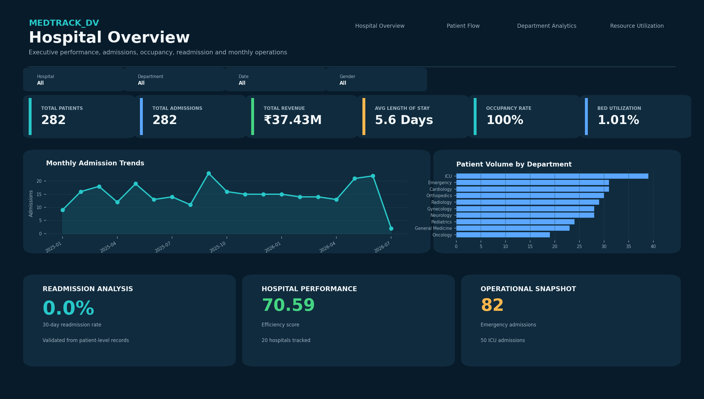
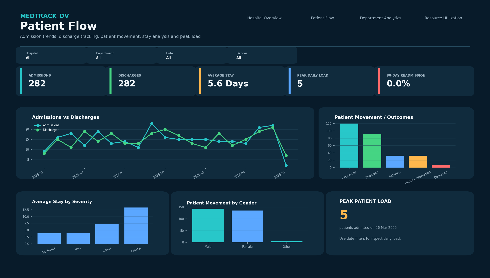
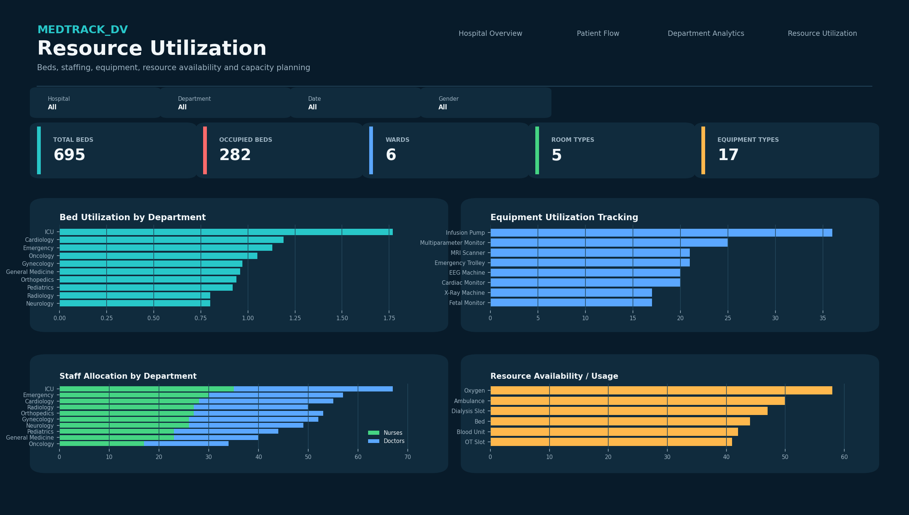

# MedTrack_DV — Hospital Operations & Patient Analytics Dashboard

> An end-to-end healthcare analytics and business intelligence project that transforms hospital and patient admission data into actionable operational insights using Python, Pandas, NumPy and Tableau.


## 📌 Project Overview

**MedTrack_DV** is a healthcare analytics and business intelligence solution created to analyze hospital operations, patient movement, departmental performance and resource utilization.

The project converts raw hospital records into a structured, Tableau-ready analytical dataset and presents the results through an interactive dashboard suite. The solution is designed from an **executive management perspective**, allowing users to move from high-level hospital KPIs to detailed patient-flow, department and resource insights.

### The project focuses on five major business questions

1. **How is the hospital performing overall?**
2. **How are patients moving through the hospital?**
3. **Which departments have the highest workload and efficiency?**
4. **How effectively are beds, staff and equipment being utilized?**
5. **Where are operational improvements or future capacity planning opportunities required?**

## 🎯 Project Objectives

* Build a complete healthcare analytics workflow from raw data to dashboard.
* Clean and validate hospital and patient-level records.
* Engineer meaningful healthcare KPIs.
* Analyze admissions, discharges and length of stay.
* Monitor 30-day readmission performance.
* Compare patient volume across hospital departments.
* Measure department efficiency.
* Analyze bed occupancy and utilization.
* Evaluate staffing allocation between doctors and nurses.
* Track equipment usage and resource availability.
* Provide interactive filters for hospital, department, date and gender.
* Create a professional executive dashboard suitable for business intelligence reporting.

## 🧩 End-to-End Analytics Architecture

```text
Raw Hospital Data
       ↓
Data Collection / Generation
       ↓
Data Cleaning & Validation
       ↓
Feature Engineering
       ↓
Healthcare KPI Calculation
       ↓
Tableau-Ready Dataset
       ↓
Interactive Tableau Dashboards
       ↓
Testing & KPI Validation
       ↓
Business Insights & Reporting
```

## 🗂️ Data Processing

The source dataset contains hospital, patient, admission, discharge, department, resource and operational information.

### Data preparation activities

* Removed duplicate records.
* Validated patient and admission identifiers.
* Standardized date fields.
* Checked admission and discharge date relationships.
* Converted numerical fields into appropriate data types.
* Validated age and operational measures.
* Handled missing and inconsistent values.
* Created calculated length-of-stay measures.
* Created readmission indicators.
* Created hospital-, department- and month-level KPI summaries.

The cleaned data is transformed into a **Tableau-ready analytical dataset** containing the required patient-level and aggregated KPI information.

## 📊 Dashboard Suite

The final Tableau solution contains **four interconnected dashboards**. All dashboards use a consistent visual language and common filtering concepts so users can move between executive, patient-flow, departmental and resource-level analysis.

### 1. 🏥 Hospital Overview

The **Hospital Overview** is the executive-level dashboard. It provides a quick snapshot of hospital activity and performance.

#### Main KPIs

* Total Patients
* Total Admissions
* Total Revenue
* Average Length of Stay
* Occupancy Rate
* Bed Utilization

#### Visual analysis

* Monthly Admission Trends
* Patient Volume by Department
* Readmission Analysis
* Hospital Performance / Efficiency Score
* Operational Snapshot

#### Business purpose

This dashboard helps hospital management quickly identify overall operational performance, admission trends, workload concentration and potential capacity concerns.

### Hospital Overview Screenshot



---

### 2. 👥 Patient Flow

The **Patient Flow** dashboard focuses on how patients move through the hospital from admission to discharge and the resulting outcomes.

#### Main KPIs

* Admissions
* Discharges
* Average Stay
* Peak Daily Load
* 30-Day Readmission Rate

#### Visual analysis

* Admissions vs Discharges trend
* Patient Movement / Outcomes
* Average Stay by Severity
* Patient Movement by Gender
* Peak Patient Load

#### Business purpose

This dashboard helps identify changes in patient volume, discharge behavior, severity-related stay patterns and periods of high patient load.

### Patient Flow Screenshot



---

### 3. 🏢 Department Analytics

The **Department Analytics** dashboard compares departments from a workload, efficiency and capacity perspective.

#### Main KPIs

* Number of Departments
* Patient Volume
* Average Efficiency
* Average Department LOS
* Average Readmission Rate

#### Visual analysis

* Patient Volume by Department
* Department Efficiency Comparison
* Readmission by Department
* Treatment Capacity
* Doctors Allocated
* Nurses Allocated
* Equipment Types

#### Business purpose

This dashboard allows managers to identify high-volume departments, compare efficiency, understand length-of-stay differences and review treatment capacity.

### Department Analytics Screenshot


---

### 4. 🛏️ Resource Utilization

The **Resource Utilization** dashboard evaluates the hospital's physical and human resources.

#### Main KPIs

* Total Beds
* Occupied Beds
* Number of Wards
* Room Types
* Equipment Types

#### Visual analysis

* Bed Utilization by Department
* Equipment Utilization Tracking
* Staff Allocation by Department
* Resource Availability / Usage

#### Business purpose

This dashboard supports capacity planning by showing where beds, equipment and staff are being used and where resource allocation may require attention.

### Resource Utilization Screenshot



## 🎛️ Dashboard Interactivity

The dashboards provide common filters for:

* **Hospital**
* **Department**
* **Date**
* **Gender**

The Tableau solution also supports dashboard navigation and cross-analysis between different operational views.

This allows a user to start with the hospital-wide view and progressively investigate a specific department, time period or patient segment.

## 📈 Key KPIs

| KPI                         | Overall Result |
| --------------------------- | -------------: |
| Total Admissions            |        **282** |
| Total Patients              |        **282** |
| Hospitals Tracked           |         **20** |
| Departments                 |         **10** |
| Doctors Allocated           |         **79** |
| Nurses Allocated            |        **131** |
| Average Length of Stay      |  **5.60 days** |
| Occupancy Rate              |    **100.00%** |
| 30-Day Readmission Rate     |      **0.00%** |
| Bed Utilization Rate        |      **1.01%** |
| Department Efficiency Score |      **70.59** |

## 🧮 KPI Definitions

### Total Admissions

The total number of admission records represented in the cleaned analytical dataset.

### Total Patients

The number of distinct patients represented in the dataset.

### Average Length of Stay

Calculated from the difference between the patient's discharge date and admission date and summarized across the selected population.

### 30-Day Readmission Rate

Measures the percentage of patients with a subsequent admission within the defined 30-day period after discharge.

### Occupancy Rate

Represents the proportion of available hospital beds occupied by patients.

### Bed Utilization Rate

Measures the use of available bed capacity over the relevant analysis period.

### Department Efficiency Score

A composite analytical measure used to compare departmental operational performance using relevant efficiency and utilization indicators.

## 🔎 Key Analytical Insights

The dashboard provides several useful observations from the project dataset:

* **ICU** has the highest patient volume, with **39 admissions**.
* ICU also shows the highest average departmental length of stay at approximately **9.41 days**.
* **Orthopedics** records the lowest average length of stay at approximately **4.20 days**.
* Orthopedics has the highest calculated department efficiency score at approximately **71.73**.
* **September 2025** records the highest monthly admission count with **23 admissions**.
* The dashboard provides visibility into staffing through separate **doctor and nurse allocation** measures.
* Equipment utilization tracking highlights the relative usage of equipment such as infusion pumps, multiparameter monitors, MRI scanners, emergency trolleys, ECG machines, cardiac monitors, X-ray machines and fetal monitors.

> These insights are based on the project dataset and are intended for analytics demonstration rather than clinical decision-making.

## 🛠️ Technology Stack

| Technology           | Purpose                                          |
| -------------------- | ------------------------------------------------ |
| **Python**           | Data processing and automation                   |
| **Pandas**           | Data cleaning, transformation and aggregation    |
| **NumPy**            | Numerical calculations                           |
| **Jupyter Notebook** | Exploratory analysis and transformation workflow |
| **CSV / Excel**      | Data storage and exchange                        |
| **Tableau Desktop**  | Interactive dashboard development                |
| **Tableau `.twbx`**  | Packaged dashboard delivery                      |
| **Git / GitHub**     | Version control and project sharing              |
| **Markdown**         | Project documentation                            |

## 🔄 Detailed Workflow

### Step 1 — Data Collection

Hospital and patient-related records are collected/generated and organized into a structured source dataset.

### Step 2 — Data Cleaning

The raw data is inspected for duplicates, missing values, incorrect data types, inconsistent dates and invalid operational values.

### Step 3 — Data Transformation

Relevant fields are standardized and additional analytical fields are created, including length of stay and readmission indicators.

### Step 4 — KPI Engineering

Hospital-level, department-level and monthly KPI summaries are calculated and integrated into the Tableau-ready dataset.

### Step 5 — Dashboard Development

Four dashboards are developed in Tableau to represent executive performance, patient flow, department analytics and resource utilization.

### Step 6 — Dashboard Integration

Common filters, navigation and analytical interactions are added to provide a consistent user experience.

### Step 7 — Validation

Dashboard KPIs are compared against the generated analytical summaries to verify that displayed values are consistent with the processed data.

### Step 8 — Documentation

The final project includes datasets, Python scripts, Tableau workbooks, dashboard screenshots and supporting documentation.

## 📁 Repository Structure

```text
MedTrack_DV/
│
├── data/
│   ├── hospital_raw_data.csv
│   ├── cleaned_patients.csv
│   ├── hospital_dataset.xlsx
│   ├── hospital_final_dataset.xlsx
│   └── hospital_kpi_summary.xlsx
│
├── scripts/
│   ├── data_collection.py
│   ├── generate_hospital_kpis.py
│   └── hospital_cleaning.ipynb
│
├── dashboard/
│   ├── MedTrack_DV.twbx
│   └── medtrack_prototype.twbx
│
├── docs/
│   ├── images/
│   │   ├── 01_Hospital_Overview.png
│   │   ├── 02_Patient_Flow.png
│   │   ├── 03_Department_Analytics.png
│   │   └── 04_Resource_Utilization.png
│   ├── dashboard_storyboard.pdf
│   ├── MedTrack_DV_Final_Documentation.docx
│   ├── MedTrack_Module_7_Testing_and_Validation.docx
│   └── Module_4_Dashboard_Planning_Prototyping_Hospital_Analytics.pptx
│
└── README.md
```

## 🚀 Installation & Setup

### 1. Clone the repository

```bash
git clone https://github.com/<your-username>/MedTrack_DV.git
cd MedTrack_DV
```

### 2. Install Python dependencies

```bash
pip install pandas numpy openpyxl faker
```

### 3. Run the data preparation script

```bash
python scripts/data_collection.py
```

### 4. Generate KPI outputs

```bash
python scripts/generate_hospital_kpis.py
```

### 5. Open the Tableau workbook

Open the following packaged workbook in **Tableau Desktop**:

```text
dashboard/MedTrack_DV.twbx
```

If the workbook is moved to another machine, refresh or reconnect the Tableau data source if the original local file path is no longer available.

## 📦 Main Deliverables

| Deliverable                                     | Purpose                              |
| ----------------------------------------------- | ------------------------------------ |
| `hospital_raw_data.csv`                         | Raw source data                      |
| `cleaned_patients.csv`                          | Cleaned patient/admission data       |
| `hospital_dataset.xlsx`                         | Source Excel dataset                 |
| `hospital_final_dataset.xlsx`                   | Final Tableau-ready dataset          |
| `hospital_kpi_summary.xlsx`                     | KPI summary outputs                  |
| `data_collection.py`                            | Data collection/preparation workflow |
| `generate_hospital_kpis.py`                     | KPI generation workflow              |
| `hospital_cleaning.ipynb`                       | Cleaning and transformation notebook |
| `MedTrack_DV.twbx`                              | Final integrated Tableau workbook    |
| `medtrack_prototype.twbx`                       | Dashboard prototype                  |
| `dashboard_storyboard.pdf`                      | Dashboard planning/storyboard        |
| `MedTrack_DV_Final_Documentation.docx`          | Final project documentation          |
| `MedTrack_Module_7_Testing_and_Validation.docx` | Testing and validation documentation |

## 🧪 Testing & Validation

The project validates both the data pipeline and dashboard implementation.

### Data validation

* Record counts checked before and after cleaning.
* Duplicate records reviewed.
* Date fields validated.
* Numeric fields checked for valid values.
* KPI outputs reviewed against source calculations.

### Dashboard validation

* KPI cards checked against calculated summaries.
* Filters tested for correct behavior.
* Dashboard navigation tested.
* Charts checked for correct dimensions and measures.
* Department and patient-flow metrics compared against expected values.
* Resource utilization visuals reviewed for consistency.

## 📌 Business Value

MedTrack_DV demonstrates how healthcare organizations can use business intelligence to convert operational data into decision-support information.

The dashboard can help stakeholders:

* Monitor hospital workload.
* Identify high-volume departments.
* Understand patient stay patterns.
* Track readmission performance.
* Review bed utilization.
* Compare departmental efficiency.
* Understand staffing distribution.
* Monitor equipment usage.
* Support capacity planning.
* Identify areas requiring deeper operational investigation.

## 🔐 Data Privacy & Responsible Use

This project is intended for **portfolio, educational and analytics demonstration purposes**.

Before publishing the repository publicly:

* Do not include real patient names or personally identifiable information.
* Remove sensitive medical information.
* Use synthetic or anonymized data whenever possible.
* Review Tableau extracts and packaged workbooks for sensitive information.
* Avoid presenting dashboard outputs as medical advice or clinical recommendations.

## 🔮 Future Enhancements

* Connect the dashboard to a production hospital data warehouse.
* Add scheduled or real-time data refresh.
* Implement admission-volume forecasting.
* Add bed-demand forecasting.
* Add staffing-demand forecasting.
* Create automated alerts for high occupancy.
* Improve readmission analysis using richer patient histories.
* Add department-level drill-downs.
* Add role-based dashboards for administrators, department managers and operations teams.
* Add automated data-quality monitoring.
* Add privacy-safe patient-level drill-through analysis.
* Add predictive analytics for resource demand.
* Deploy dashboards through a secure enterprise BI environment.

## 👩‍💻 Project Summary

**MedTrack_DV** demonstrates an end-to-end healthcare data analytics workflow covering **data preparation, KPI engineering, business analysis, visualization, dashboard development, testing and documentation**.

The project combines Python-based data processing with Tableau-based interactive visualization to provide a unified view of hospital performance, patient flow, department analytics and resource utilization.

**Built with:** Python • Pandas • NumPy • Jupyter Notebook • Excel • Tableau • GitHub
